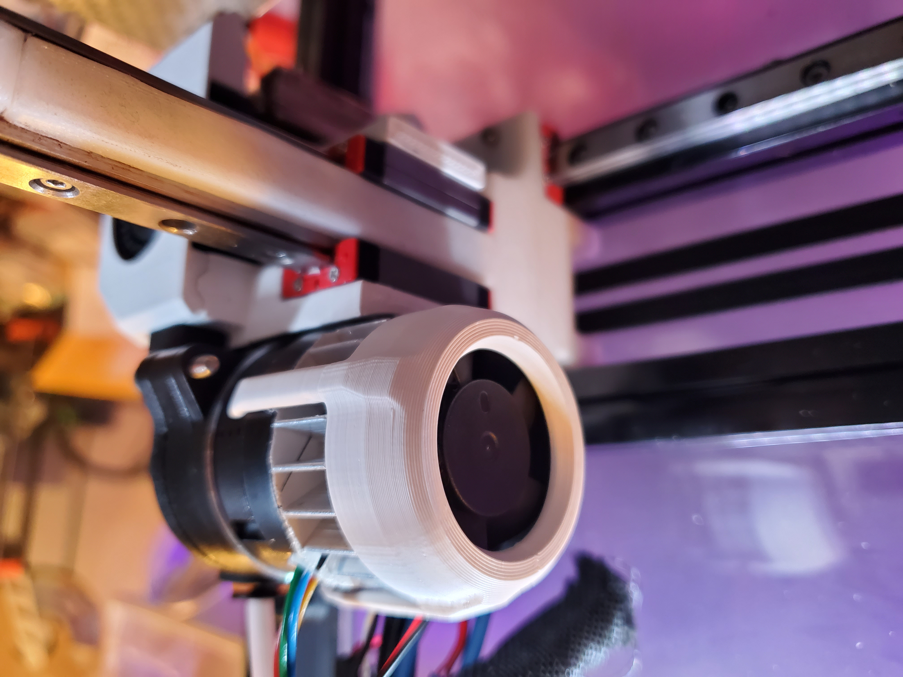
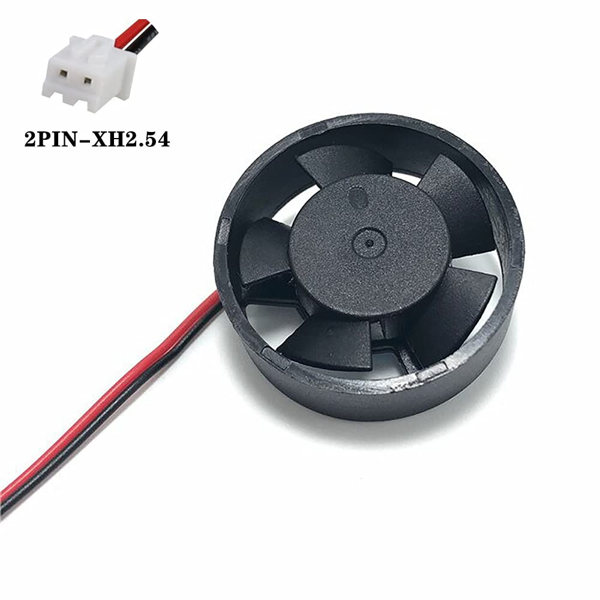
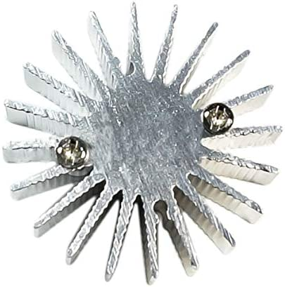
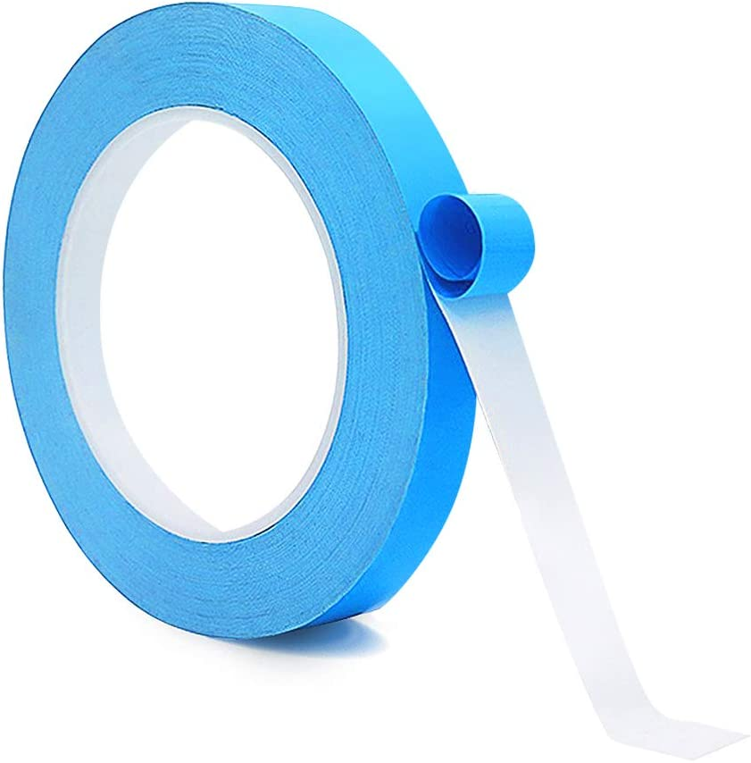

#Pancake Stepper Fan Mount
Simple design for a fan/heatsink combination attached to a stepper motor

##Why?
Stepper motors get hot, and many are designed to do so. However, the extruders will carry the heat through their metal gears directly to the 3D printer filament, softening it before it goes into the hot end. This will have a huge effect on print quality, and in some cases, create jams. Jams from softened filament happen more often in PLA but can also be a problem with hotter filaments when using an enclosed chamber. 

##Directions
1. Print the supplied .3mf file in the filament of your choice with 3 primiters. It is not completely symetrical to line up with the heatsink fins. I would splice the wires together with your hot end cooling fan so that it turns on whenever you're about to start pusing filament. 

2. Apply thermal tape directly to the back of the pancake stepper and press the heatsink on firmly. 

3. Push the fan into the printed mountand snap on over stepper/headsink assembly.

|Part        | Link     | Notes|
|--------------|-----------|------------|
|  |  [Amazon Link](https://www.amazon.com/gp/product/B08C6Y246L/ref=ppx_yo_dt_b_asin_title_o06_s00?ie=UTF8&th=1)    |        |
|  | [Amazon Link](https://www.amazon.com/gp/product/B07GZMSKW4/ref=ppx_yo_dt_b_asin_title_o09_s00?ie=UTF8&psc=1)  |       |
| |[.3mf file](StepperFanMount.3mf)|3 primiters|
|   |[Amazon Link](https://www.amazon.com/gp/product/B08MZGJCGB/ref=ppx_yo_dt_b_search_asin_title?ie=UTF8&psc=1)|0.25mm thickness, trim to fit