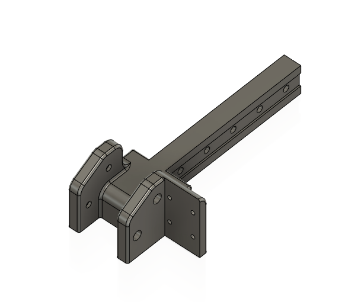
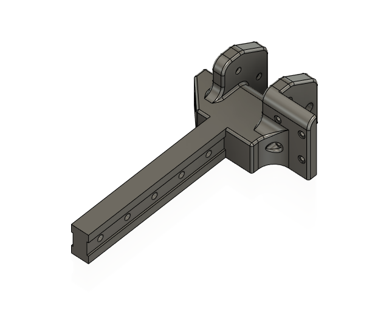
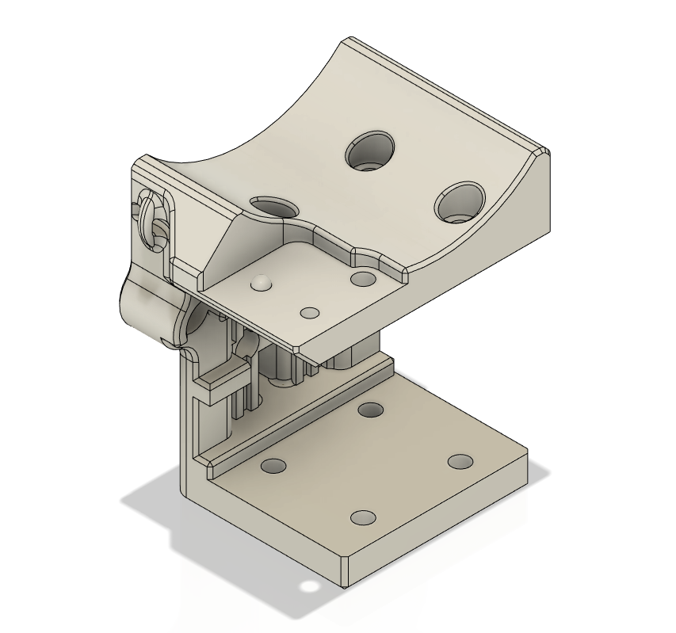

# Dual Rail Gantry for Voron 0
Drop in replacement for single x rail. 

## Why?
Even the best MGN7 rails have some unwanted wobble, which when adding movement from printers can have artifacts in print quality. Typically stepping up a rail size will significantly help, however that may require changing too many parts, or lose build volume. 

This dual rail design can reduce wobble in the print head while not losing any build volume. It can be printed in 2 pieces and reduces the need for an aluminum extrusion

## Directions
1. Print the supplied .3mf files in the filament of your choice with 4 primiters and 40% infill. 

2. Install heat set inserts alternating sides

3. Screw on rails (loosly) alternating sides and skip every other hole. 
4. Choose the block mount of your choice and loosly screw it to both rail blocks. 
5. Test to make sure the rail mount can glide easily throughout the entire rail. If it does't, tighten or losen the rails. 
6. Attach to the Y rails of your Voron 0. You may have to losen the rails on the gantry; this is fine. 
7. Retighten the gantry rails and again check for movement. 
8. Remove block mount to attach the belts. 
   1. Don't forget to add the heat set inserts to the rail block like in the original Voron 0 directions. 
9.  Finally attach the block mount to the rail blocks again. 

|Part        | Link     | Notes|
|--------------|-----------|------------|
|10x M2 8mm cap head  |      |        |
|4x more M2 6mm cap head  |      |        |
|1 more MGN7 rail and block|  |       |
| |[.3mf file](GantryLeft.3mf)|4 primiters / 40% infill|
|   |[.3mf file](GantryRight.3mf)|4 primiters / 40% infil|
|   |[.3mf file](BlockMount.3mf)|4 primiters / 40% infil|

## Results
//TODO

## Other Block Mount Options
//TODO add links other mounting options
1. Orbiter
2. LGX Lite