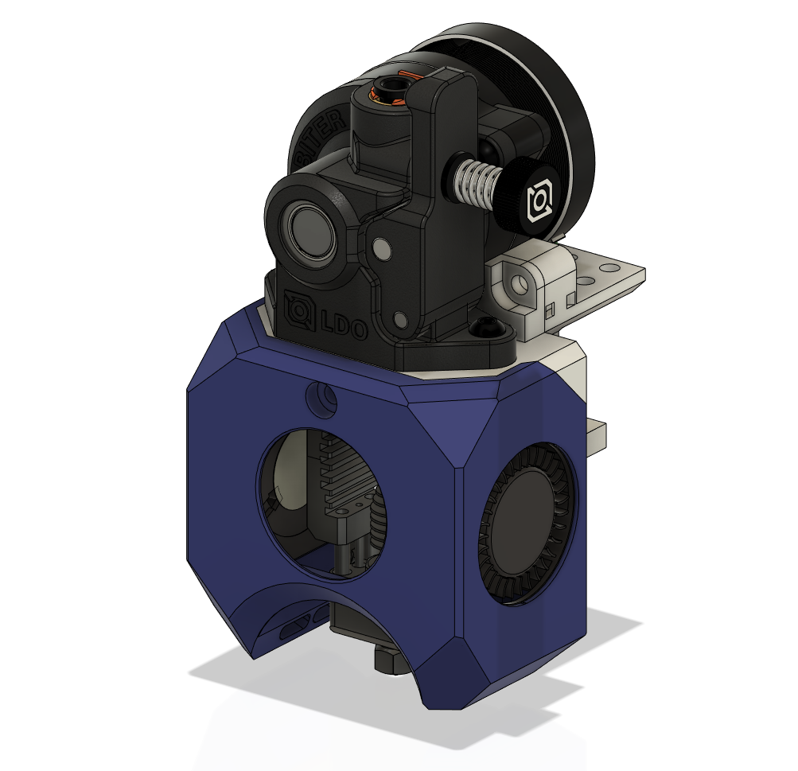
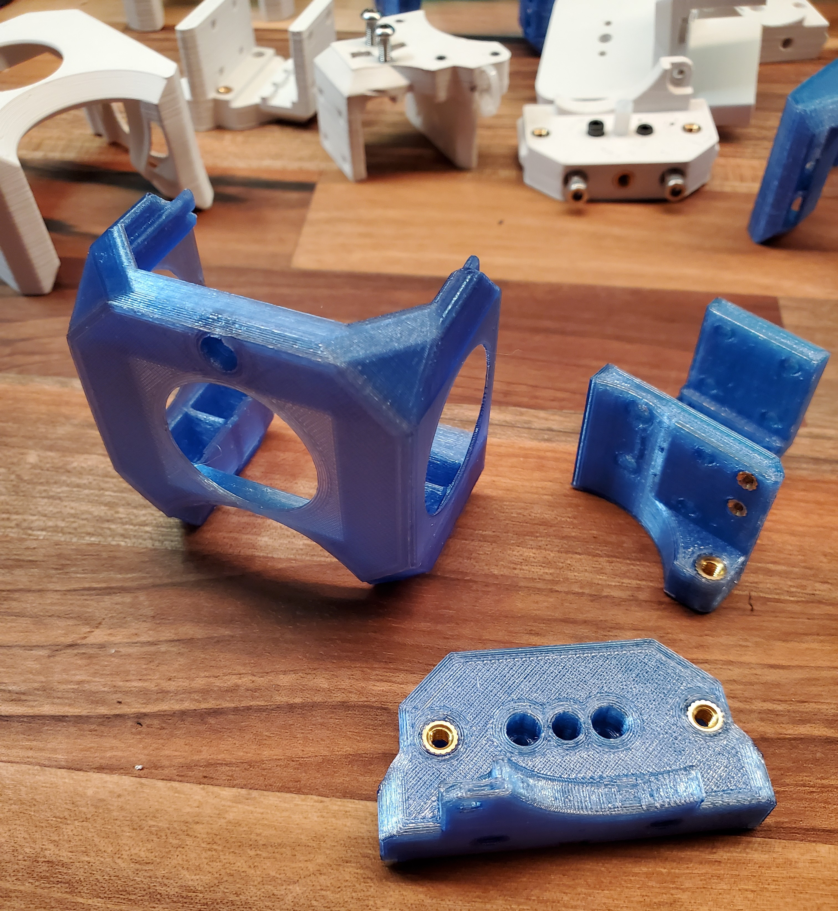
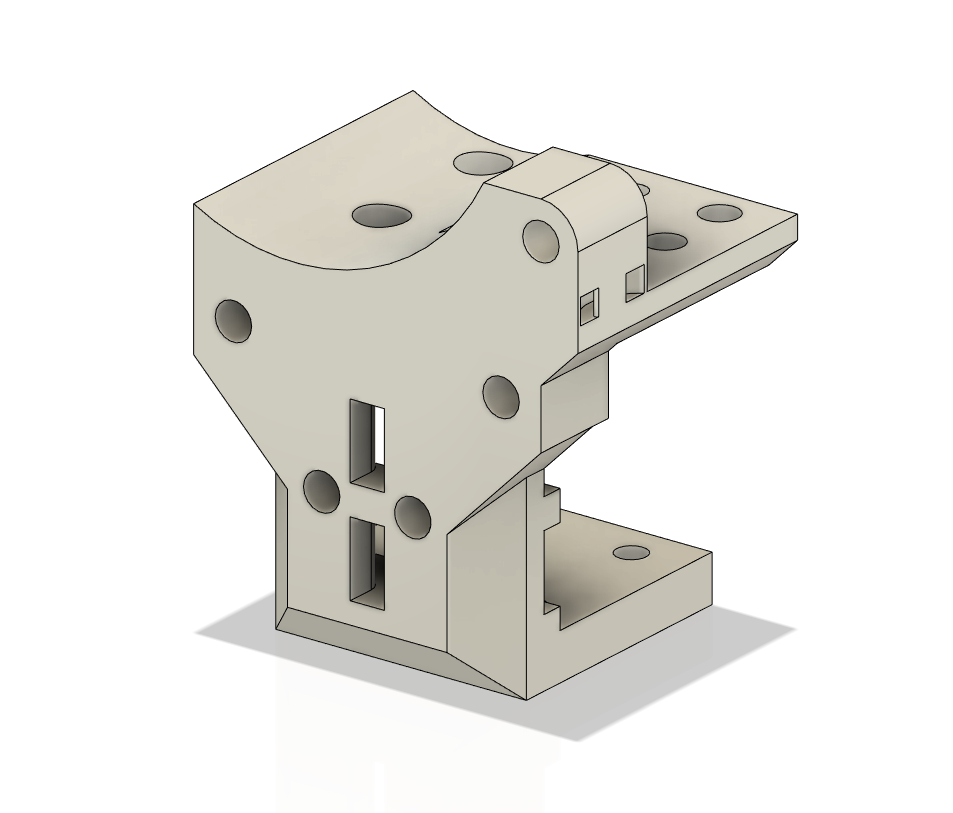
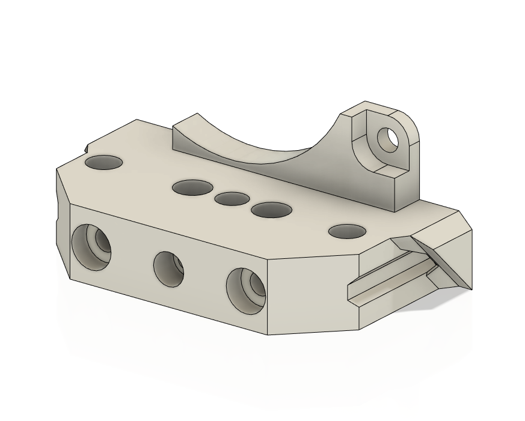
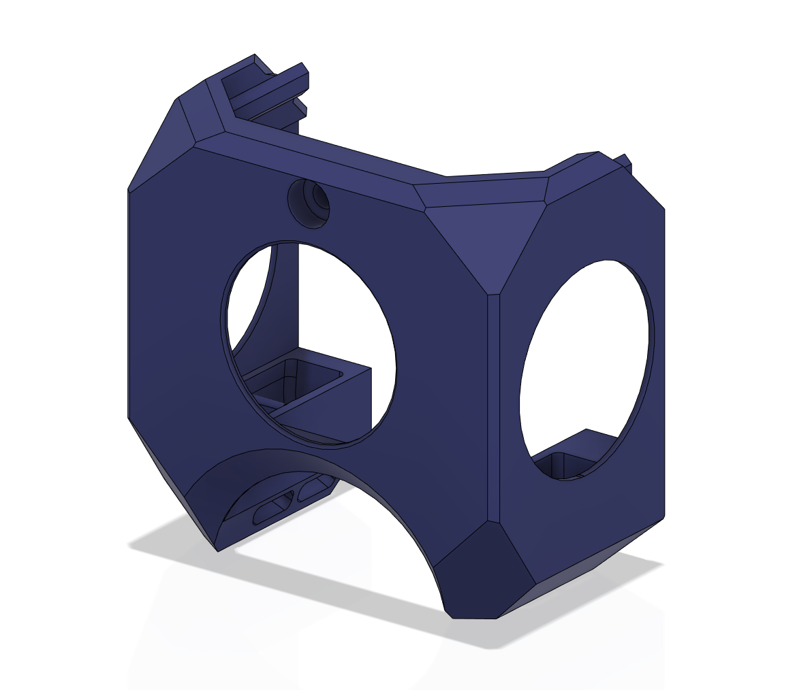

# Toolhead for Orbiter 2 and Mosquito 
Replacement for Mini Afterburner
## Why?
The Mini Afterburner is all one piece on top of a very flimsy mount. If a fan goes bad or extruder gets jamed you must take the entire thing apart. Recently the wires broke on my thermistor which finally made me look for better options. I knew I wanted a design where each piece could be serviced individually. 

Since I didn't want to design a new extruder I looked at LGX Lite, Sherpa Mini, and Orbiter 2. I choose the Orbiter 2 for a few reasons: It had larger gears than the Sherba for flexibles, and it could be removed by 2 top screws unlike the LGX. All are good choices and you can't go wrong with any of them. 

## The Design
I kept my [Dual Rail Design](https://github.com/ryangadz/3DPrinters/tree/main/Voron0/Mods/DualRailGantry) and wanted a more robust Block Mount with 3 or more screws to attach the Tool Mount. The Fan Cowl would go on last with one screw. After several prototyes of moving around screw holes I finally got 2 pieces I was happy with. It could be adapted easily for other hot ends but the extruder has to remain. 

The Fan Cowl was straightforward and mostly cosmetic but after melting a few in ASA I refined the design and made tabs in the back so it doesn't bend with the heat. 

Note: this does raise the hot end up 3mm (intentionally since i use a thick carbon fiber sheet on the build plate). For others you'll just gain 3mm in the Z axis. 

## Directions
1. Print the supplied .3mf files in the filament of your choice with 4 primiters and 40% infill. 

2. Install heat set inserts 

3. TEST FIT and make sure everything goes together nicely. The fan cowl should come off easily, if it does not sand down the tabs. 
4. Add a zip tie to the Block Mount
5. Attach the Block Mount to the belts like you'd normall would. *I tried to make this easier but it will have to wait for a later design.*
6. Securely fasten the Tool Mount
7. Attach the X endstop switch with M2 screws
8. Attach the Mosquito hotend and 25mm fan
9. Cut and insert the PTFE tube
10. Attach the Orbiter 2
11. Add left and right blower fans to fan cowl, running the left wire behind the hot end. 
12. Attach the fan cowl
13. Adjust your new Z offset!

|Part        | Link     | Notes|
|--------------|-----------|------------|
|2x M3 30mm cap head  |      |        |
|6x M3 heat set inserts  |      |        |
|2x M2 heat set inserts  |      |        |
||  |       |
| |[.3mf file](BlockMount.3mf)|4 primiters / 40% infill|
|   |[.3mf file](ToolMount.3mf)|4 primiters / 40% infil|
|   |[.3mf file](FanCowl.3mf)|3 primiters / 20% infil|

## Results
//TODO

## Extras
|Part        | Link     | Notes|
|--------------|-----------|------------|
| |[Stepper Fan Mount](https://github.com/ryangadz/3DPrinters/tree/main/UniversalParts/StepperFanMount)||

## Notes
